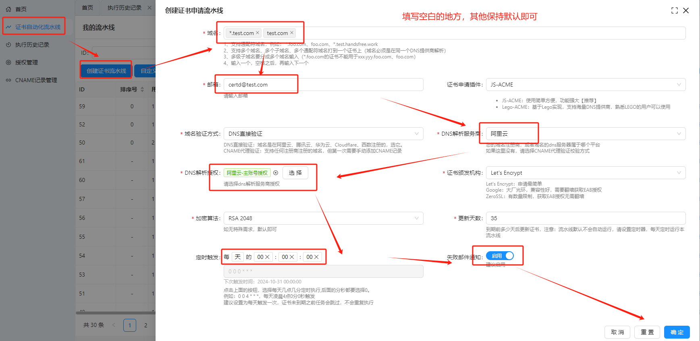
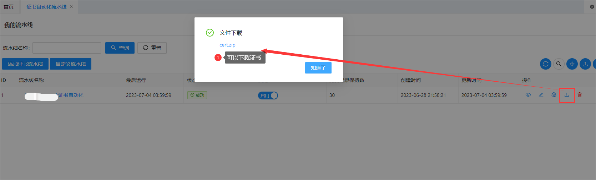
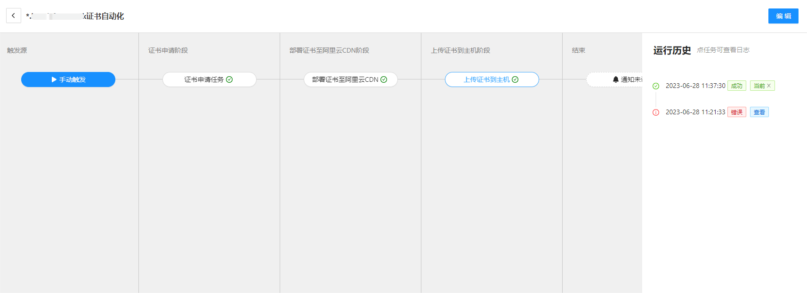

# Certd

Certd 是一个免费全自动申请和自动部署更新SSL证书的管理系统。       
后缀d取自linux守护进程的命名风格，意为证书守护进程。    

关键字：证书自动申请、证书自动更新、证书自动续期、证书自动续签、证书管理工具

## 一、特性
本项目不仅支持证书申请过程自动化，还可以自动化部署更新证书，让你的证书永不过期。     

* 全自动申请证书（支持所有注册商注册的域名）
* 全自动部署更新证书（目前支持部署到主机、部署到阿里云、腾讯云等，目前已支持30+部署插件）
* 支持通配符域名/泛域名，支持多个域名打到一个证书上
* 邮件通知
* 私有化部署，数据保存本地，镜像由Github Actions构建，过程公开透明
* 支持sqlite，postgresql数据库


## 二、在线体验

官方Demo地址，自助注册后体验    

https://certd.handfree.work/

> 注意数据将不定期清理，不定期停止定时任务，生产使用请自行部署    
> 包含敏感信息，务必自己本地部署进行生产使用


## 三、使用教程

仅需3步，让你的证书永不过期

### 1. 创建证书流水线


> 添加成功后，就可以直接运行流水线申请证书了

### 2. 添加部署任务
当然我们一般需要把证书部署到应用上，certd支持海量的部署插件，您可以根据自身实际情况进行选择，比如部署到Nginx、阿里云、腾讯云、K8S、CDN、宝塔、1Panel等等

此处演示部署证书到主机的nginx上    


如果目前的部署插件都无法满足，您也可以手动下载，然后自行部署   


### 3. 定时运行



↓↓↓↓↓↓↓↓↓↓↓↓↓↓↓↓↓↓↓↓↓↓↓↓↓↓↓↓↓↓↓↓↓↓↓↓↓↓↓↓      
-------> [点我查看详细使用步骤演示](./step.md)   <--------      
↑↑↑↑↑↑↑↑↑↑↑↑↑↑↑↑↑↑↑↑↑↑↑↑↑↑↑↑↑↑↑↑↑↑↑↑↑↑↑↑     

更多教程请访问文档网站 [certd.docmirror.cn](https://certd.docmirror.cn/)


## 四、私有化部署

由于证书、授权信息等属于高度敏感数据，请务必私有化部署，保障数据安全    

您可以根据实际情况从如下方式中选择一种方式进行私有化部署：

1. [宝塔面板方式部署](https://certd.docmirror.cn/guide/install/docker/)
2. [1Panel面板方式部署](https://certd.docmirror.cn/guide/install/1panel/)
3. [Docker方式部署](https://certd.docmirror.cn/guide/install/docker/)
4. [源码方式部署](https://certd.docmirror.cn/guide/install/source/)

#### Docker镜像说明：
* 国内镜像地址:
  * `registry.cn-shenzhen.aliyuncs.com/handsfree/certd:latest`
  * `registry.cn-shenzhen.aliyuncs.com/handsfree/certd:armv7`、`[version]-armv7`
* DockerHub地址：
  * `https://hub.docker.com/r/greper/certd`
  * `greper/certd:latest`
  * `greper/certd:armv7`、`greper/certd:[version]-armv7`

* 镜像构建通过`Actions`自动执行，过程公开透明，请放心使用
  * [点我查看镜像构建日志](https://github.com/certd/certd/actions/workflows/build-image.yml) 


## 五、 升级
如果使用固定版本号
1. 修改`docker-compose.yaml`中的镜像版本号
2. 运行`docker compose up -d` 即可

如果使用`latest`版本
```shell
#重新拉取镜像
docker pull registry.cn-shenzhen.aliyuncs.com/handsfree/certd:latest
# 重新启动容器
docker compose down
docker compose up -d
```

> 数据默认存在`/data/certd`目录下，不用担心数据丢失   


更新日志： [CHANGELOG](./CHANGELOG.md)


## 六、一些说明
* 本项目ssl证书提供商为letencrypt/Google/ZeroSSL
* 申请过程遵循acme协议
* 需要验证域名所有权，一般有两种方式（目前本项目仅支持dns-01）
  * http-01： 在网站根目录下放置一份txt文件
  * dns-01： 需要给域名添加txt解析记录，通配符域名只能用这种方式
* 证书续期：
  * 实际上没有办法不改变证书文件本身情况下直接续期或者续签。
  * 我们所说的续期，其实就是按照全套流程重新申请一份新证书，然后重新部署上去。
* 免费证书过期时间90天，以后可能还会缩短，所以自动化部署必不可少
* 设置每天自动运行，当证书过期前20天，会自动重新申请证书并部署


## 七、不同平台的设置说明

* 已迁移到新的文档网站，请到常见问题章节查看
* [最新文档站链接 https://certd.docmirror.cn](https://certd.docmirror.cn/)

## 八、问题处理
### 7.1 忘记管理员密码   
[重置管理员密码方法](https://certd.docmirror.cn/guide/use/forgotpasswd/)

## 九、联系作者
如有疑问，欢迎加入群聊（请备注certd）

| 加群 | 微信群 | QQ群 |
|---------|-------|-------|
| 二维码 |  |  |

也可以加作者好友

| 加作者好友 | 微信 QQ                                                       |
|---------|-------------------------------------------------------------|
| 二维码 |  |


## 十、捐赠
************************
支持开源，为爱发电，我已入驻爱发电   
https://afdian.com/a/greper

发电权益：
1. 可加入发电专属群，可以获得作者一对一技术支持
2. 您的需求我们将优先实现，并且将作为专业版功能提供
3. 一年期专业版激活码
4. 赠送国外免费服务器部署方案（0成本使用Certd，可能需要翻墙，不过现在性能越来越差了）


专业版特权对比

| 功能      | 免费版               | 专业版                   |
|---------|-------------------|-----------------------|
| 免费证书申请  | 免费无限制             | 免费无限制                 |
| 自动部署插件  | 阿里云、腾讯云、七牛云、主机部署等 | 支持群晖、宝塔、1Panel等，持续开发中 |
| 发邮件功能   | 需要配置              | 免配置                   |
| 证书流水线条数 | 10条               | 无限制                   |

************************

## 十一、贡献代码

1. 本地开发 [贡献插件](https://certd.docmirror.cn/guide/development/)
2. 作为贡献者，代表您同意您贡献的代码如下许可：
   1. 可以调整开源协议以使其更严格或更宽松。
   2. 可以用于商业用途。


## 十二、 开源许可
* 本项目遵循 GNU Affero General Public License（AGPL）开源协议。   
* 允许个人和公司内部自由使用、复制、修改和分发本项目，未获得商业授权情况下禁止任何形式的商业用途 
* 未获得商业授权情况下，禁止任何对logo、版权信息及授权许可相关代码的修改。
* 如需商业授权，请联系作者。

## 十三、我的其他项目（求Star）

| 项目名称                                                    | stars                                                                                                 | 项目描述                              | 
|---------------------------------------------------------|-------------------------------------------------------------------------------------------------------|-----------------------------------|
| [袖手AI](https://ai.handsfree.work/)                    |                                                                                                       | 袖手GPT，国内可用，无需FQ，每日免费额度            | 
| [fast-crud](https://gitee.com/fast-crud/fast-crud/)     |    | 基于vue3的crud快速开发框架                 |  
| [dev-sidecar](https://github.com/docmirror/dev-sidecar/) |  | 直连访问github工具，无需FQ，解决github无法访问的问题 |                       


## 十四、更新日志

更新日志：[CHANGELOG](./CHANGELOG.md)


