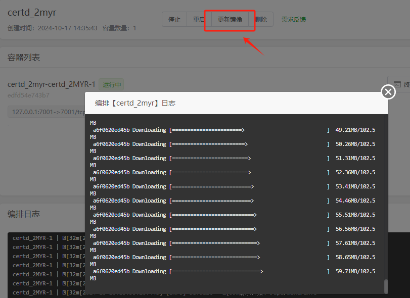

# 部署到宝塔面板

## 一、安装
宝塔面板支持两种方式安装Certd，请选择其中一种方式

### 1、安装宝塔面板

* 安装宝塔面板，前往 [宝塔面板](https://www.bt.cn/u/CL3JHS) 官网，选择`9.2.0`以上正式版的脚本下载安装
* 登录宝塔面板，在菜单栏中点击 Docker，首次进入会提示安装Docker服务，点击立即安装，按提示完成安装

### 2、部署certd

#### 2.1 应用商店一键部署【推荐】

* 在应用商店中找到`certd`（要先点右上角更新应用）
* 点击安装，配置域名等基本信息即可完成安装

> 需要宝塔9.2.0及以上版本才支持

#### 2.2 容器编排部署

1. 打开`docker-compose.yaml`,整个内容复制下来    
   https://gitee.com/certd/certd/raw/v2/docker/run/docker-compose.yaml

然后到宝塔里面进到docker->容器编排->添加容器编排   
   
点击确定，等待启动完成   

## 二、访问应用

http://ip:7001    
https://ip:7002     
默认账号密码    
admin/123456   
登录后请及时修改密码

## 三、如何升级
宝塔升级certd非常简单

`docker`->`容器编排`->`左侧选择Certd`->`更新镜像`

## 四、数据备份

### 4.1 应用商店部署方式
点击进入安装路径，数据保存在`./data`目录下，可以手动备份

### 4.2 容器编排部署方式

数据默认保存在`/data/certd`目录下，可以手动备份

### 4.3 自动备份

> 建议配置一条 [数据库备份流水线](../../use/backup/)，自动备份

## 五、备份恢复

将备份的`db.sqlite`及同目录下的其他文件一起覆盖到原来的位置，重启certd即可
