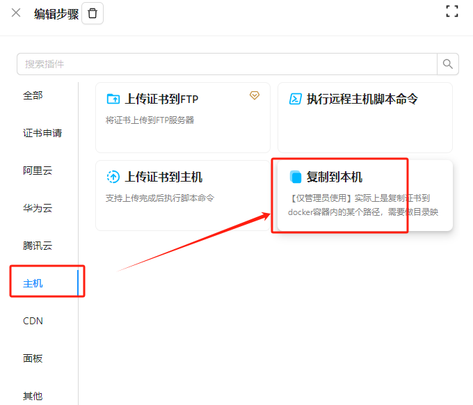
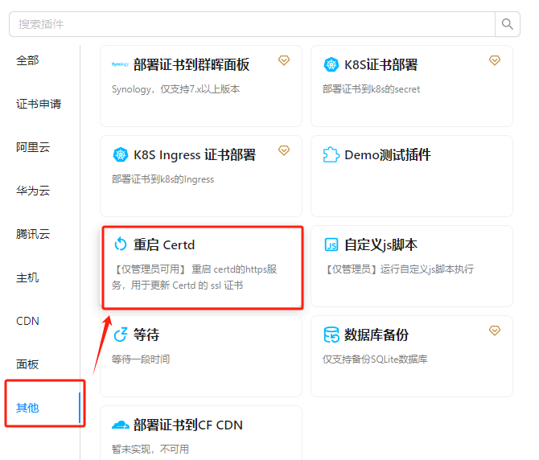
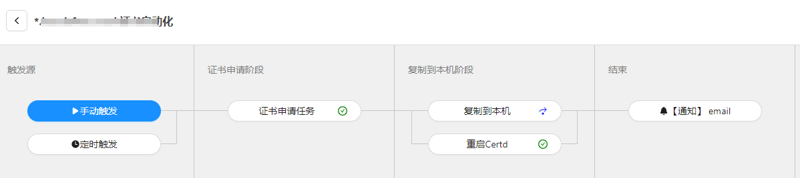

# Certd本身的https证书配置

## 一、启用https

`Certd`默认启用https，监听7002端口    
如果你想关闭https，或者修改端口，可以在环境变量中配置
```shell
CERTD_HTTPS_ENABLE=true
CERTD_HTTPS_port=7002

```

## 二、自动更新Certd的https证书

### 1、创建证书流水线

参考Certd顶部的创建证书流水线教程

### 2、配置复制到本机任务
将证书复制到certd的证书安装位置




### 3、配置重启Certd任务
重启certd的https server，让证书生效



### 4、配置定时任务
每天定时执行，最终效果如下



:::warning   
建议将本流水线的触发时间与其他流水线时间错开，避免重启时影响其他流水线的执行   
:::