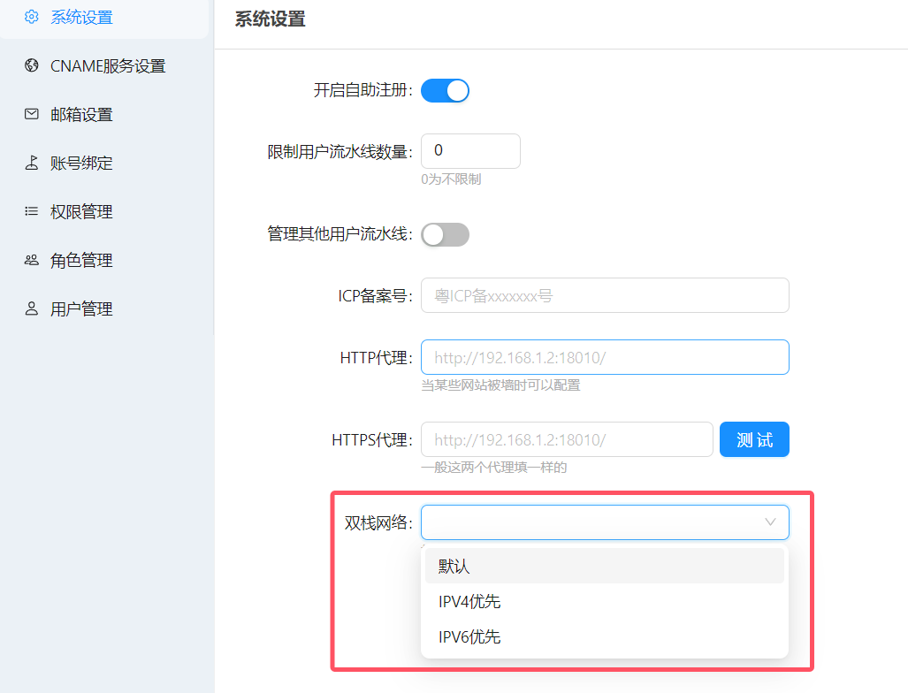

# IPv6支持

## 启用IPv6
在`docker-compose.yaml`中启用IPv6支持，放开如下注释：
```yaml
#    #↓↓↓↓ ------------------------------------------------------------- 启用ipv6网络
    networks:
      - ip6net
networks:
  ip6net:
    enable_ipv6: true
    ipam:
      config:
        - subnet: 2001:db8::/64

```

## 设置双栈网络优先级
可根据实际情况设置

