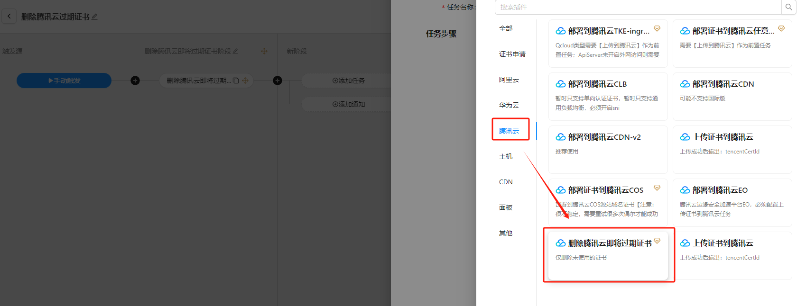
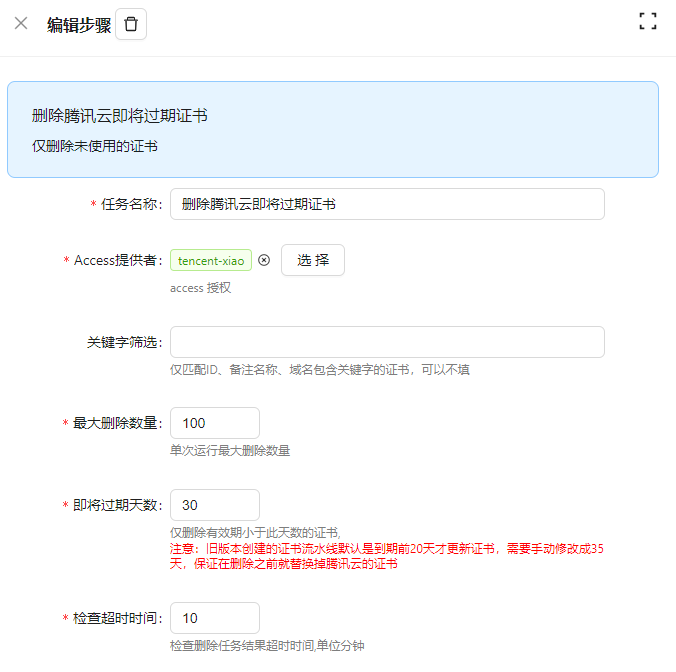

# 腾讯云

## 腾讯云API密钥设置

腾讯云其他部署需要API密钥，需要在腾讯云控制台进行设置   
打开 https://console.cloud.tencent.com/cam/capi   
然后按如下方式获取腾讯云的API密钥    

## 如何避免收到腾讯云证书过期邮件

腾讯云在证书有效期还剩28天时会发送过期通知邮件    
您可以通过配置“腾讯云过期证书删除”任务来避免收到此类邮件。

注意点：
> 1. 选择腾讯云授权，需授权`服务角色SSL_QCSLinkedRoleInReplaceLoadCertificate`权限
> 2. `1.26.14`版本之前Certd创建的证书流水线默认是到期前20天才更新证书，需要将之前创建的证书申请任务的更新天数修改为35天，保证删除之前就已经替换掉即将过期证书
